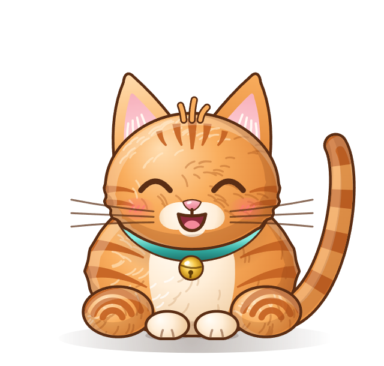
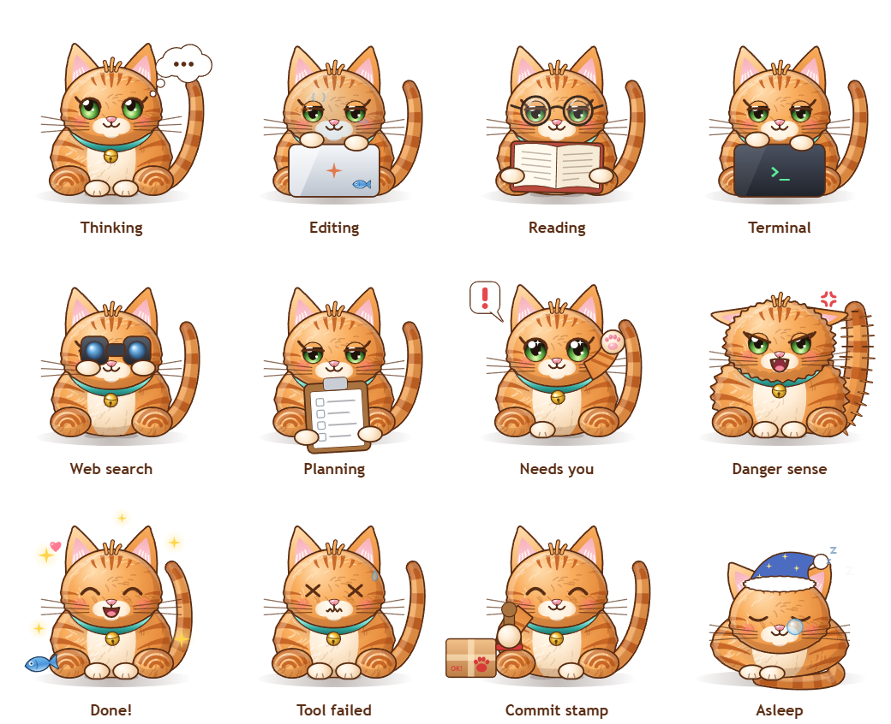
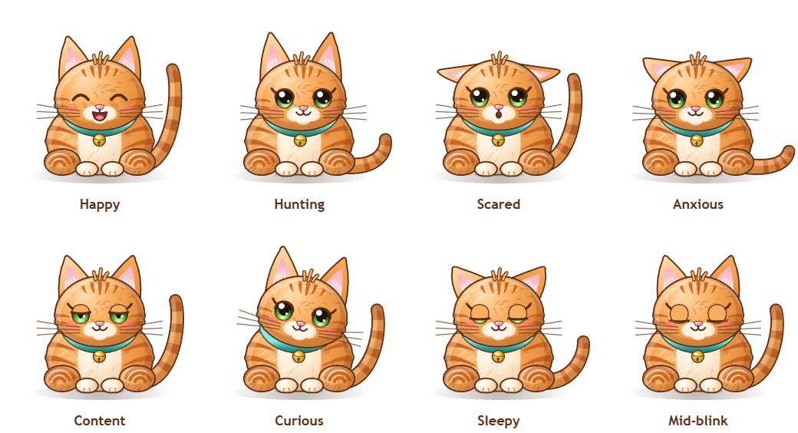
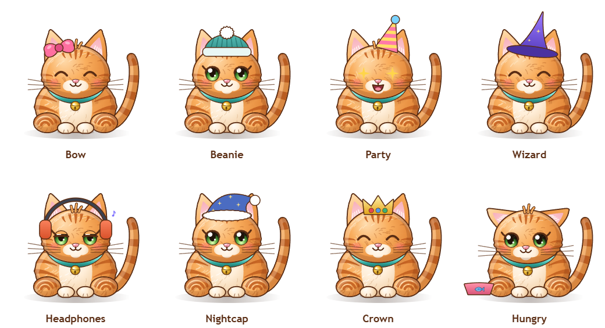
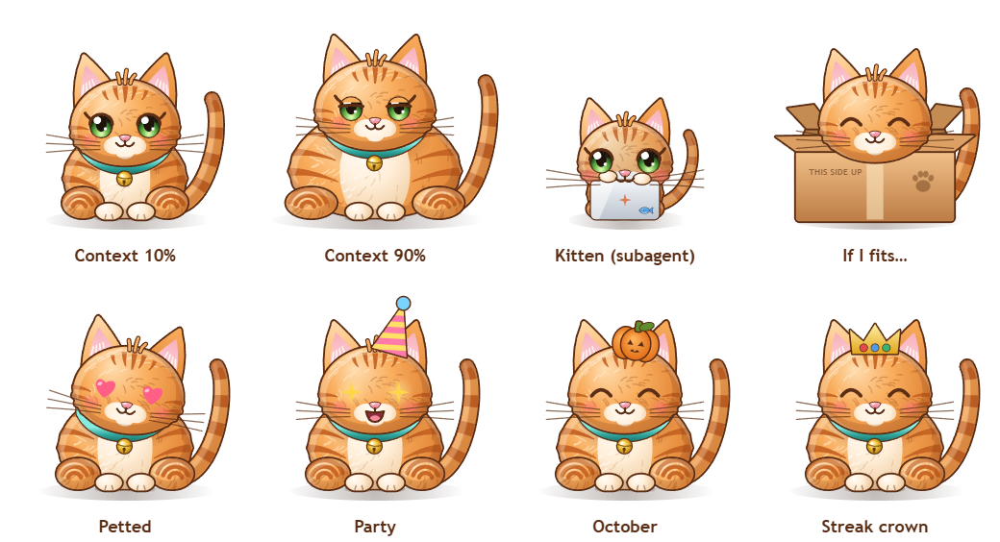
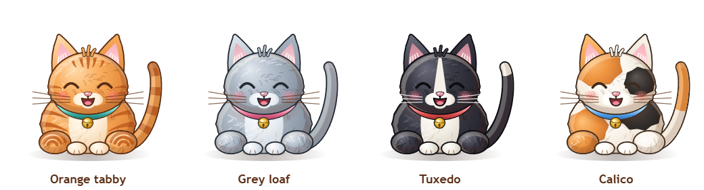

<p align="center">
  
</p>

<h1 align="center">Chonky Cat</h1>

<p align="center"><b>A chubby, always-on-top desktop cat that shows you what Claude Code is doing — live.</b><br>
Meet <b>Arshia</b> (rename her whatever you like). She types when Claude edits, reads when it reads, gets fatter as the context window fills up, burps when you <code>/compact</code>, sends kittens out for subagents, and comes over to tap on your screen when Claude needs you.</p>

<p align="center">
  <a href="#install">Install</a> ·
  <a href="#what-makes-chonky-cat-different">Features</a> ·
  <a href="#how-it-works">How it works</a> ·
  <a href="#settings">Settings</a> ·
  <a href="#faq">FAQ</a>
</p>

---

<p align="center"></p>

## Install

You need **Node 18+** and **Claude Code**. Two steps:

**1. Connect her to Claude Code** (inside Claude Code):

```
/plugin marketplace add hamzaahmadaslam/chonkycat
/plugin install chonkycat@chonkycat
```

**2. Wake her up** (in any terminal):

```bash
npx chonkycat
```

That’s it. From now on she starts by herself whenever a Claude Code session begins. Works in the Claude Code CLI, the desktop app and IDE extensions — anything that runs Claude Code hooks — on Windows, macOS and Linux.

> Prefer not to use the plugin system? `npx chonkycat install-hooks` adds the same hooks to `~/.claude/settings.json` (with a backup), and `npx chonkycat uninstall-hooks` removes them.

Want to see everything she can do right now? Run `npx chonkycat demo`.

## What makes Chonky Cat different

There are a few Claude Code desktop pets around. Arshia, your Chonky Cat, does the usual (thinking, working, needs-you, done) and then a lot more:

| | Feature | What happens |
|---|---|---|
| 🍔 | **Context-window belly** | Arshia literally gets chubbier as your context window fills. Run `/compact` and she munches through the conversation, then *burps* and slims down. |
| 🐱 | **Subagent kittens** | Every subagent Claude starts pops out as a little kitten with a name tag (`Explore`, `Plan`…) that walks off and works on its own tiny laptop, then trots home carrying a fish when it’s done. |
| 🙀 | **Danger sense** | Before `rm -rf`, `git push --force`, `git reset --hard`, `DROP TABLE`, `curl … \| sh` and friends, her fur puffs up and she hisses. The guard also makes Claude Code *ask* before those commands, even in auto-accept mode. It reads commands structurally, so text inside quotes (commit messages, grep patterns, file names) doesn't set it off. For headless `claude -p` or CI runs, where nobody can answer, turn the guard off in Settings. |
| 🐾 | **Paw approval** *(opt-in)* | Approve or deny Claude’s permission requests from a card next to Arshia. Risky commands need two clicks. Don’t answer and Claude simply asks in the terminal as usual. |
| 🪟 | **She comes to find you** | When a session has been waiting on you for a while, Arshia runs over to that terminal/editor window, sits on its title bar and taps on the glass — leaving little paw smudges. |
| 🪑 | **Window perching** | She hops onto the title bar of the window you’re using and tumbles off (“Hey, I was sitting there!”) when you drag it. |
| 📦 | **Git theater** | `git commit` → she stamps a parcel with a paw print. `git push` → the parcel launches on a rocket. Green tests → party hat and confetti. Red tests → she looks you in the eye and pushes a coffee cup off the edge. |
| 🐟 | **Fish economy** | Every finished task earns a fish. Keep a daily streak going and she earns a crown. Feed her from the menu — she gets grumpy when she’s hungry. |
| 🧘 | **Break guardian** | After 90 minutes of non-stop work she walks to the middle of the screen, flops over and suggests a stretch. |
| 💬 | **Ask Arshia** | Right-click → *Ask Arshia*: “what’s Claude doing?”, “summary”, “how full are you?”, “stats”. Answers come from your live sessions, locally, in cat voice. She can also read finished tasks aloud. |
| ☕ | **Cat café (LAN)** | Opt-in: when a teammate’s Claude finishes something, *their* cat walks across *your* screen and waves. Signed with a shared room code; only the cat’s name, skin and the event type are shared. |
| 🎭 | **60+ animations** | Grooming, yawns, stretches, kneading biscuits, sneezes, hiccups, zoomies, tail chasing, barrel rolls, butterflies, yarn, “if I fits I sits”, bird-watching, morning coffee, stargazing, dancing, peekaboo, naps with fish dreams, pouncing on your cursor… picked at random so she never feels scripted. |
| 🎃 | **Seasons & time of day** | Pumpkin hat in October, nightcap at night, coffee in the morning. |
| 🧠 | **Real cat body language** | Spring physics give her ears, tail, head and belly follow-through and overlap, so nothing snaps. Her tail rides high with a hooked tip when she's happy and drops when something fails. When she's hunting your cursor her ears go forward, her pupils go huge and her tail tip flicks. Her eyes blink (sometimes twice), dart around, and half-close when she's content. |
| 🪟 | **Take me there** | When Claude needs you, click Arshia (or the button in her bubble) and the waiting terminal or editor jumps to the front. If she's hidden, a system notification does the same. |
| 🎩 | **Wardrobe & achievements** | Unlock hats by working: a bow for your first fish, a beanie at 10 commits, a wizard hat for herding 10 subagent kittens, coder headphones for 50 pets, a crown for a 7-day streak, and more. Dress her up in Settings. |
| 🍽️ | **She gets hungry** | Leave her unfed and she sits by an empty bowl asking for fish. Feed her from the menu. |
| 📔 | **Today's diary** | Right-click, then *Today's diary*, for a recap of your day in cat voice: tasks, commits, kittens and time worked. |

<p align="center"></p>

<p align="center"></p>

<p align="center"></p>

### Play with her

- **Hover** — she purrs and her eyes turn into hearts; a roster of your sessions appears.
- **Click** — boop. **Double-click** — she jumps.
- **Drag & throw** — she dangles, flies, bounces off the screen edges and lands with a squash (too hard and she’s dizzy).
- **Right-click** — menu: ask, feed, play, nap, box, do-not-disturb, settings.
- **Leave your cursor still near her** — she crouches, wiggles… and pounces.
- `Ctrl+Alt+A` hides/shows her.

### Skins

<p align="center"></p>

Her name defaults to **Arshia** — rename her in Settings (there are suggestions like Mochi, Biscuit and Noodle, and a ↺ button to bring Arshia back). Every pixel is drawn live by a procedural vector engine (no sprite sheets), which is why she can get gradually rounder, tilt her head, hold props and blend moods.

## How it works

```
Claude Code ──hooks──▶ chonky-hook.js ──HTTP (127.0.0.1 + token)──▶ Chonky Cat app ──▶ transparent always-on-top window
```

1. The plugin registers async hooks for `SessionStart`, `UserPromptSubmit`, `PreToolUse`, `PostToolUse`, `PostToolUseFailure`, `Notification`, `Stop`, `StopFailure`, `SubagentStart/Stop`, `PreCompact/PostCompact`, `SessionEnd` and (sync) `PermissionRequest`.
2. `chonky-hook.js` trims each payload (file contents are never sent) and POSTs it to the app on `127.0.0.1`, authenticated with a random per-install token. Almost every hook runs **async**, so Claude never waits for it, and every failure path exits quietly with no output. The exceptions are the danger-sense guard, which adds roughly 0.1–0.2 s of Node start-up to each shell command and can be turned off, and paw approval, which is opt-in. On `SessionStart` it launches the app if it isn't running.
3. The app keeps a small state machine per session, mirrors the most urgent one (danger › needs-you › error › working › thinking › done › idle), and reads the **tail** of the transcript to measure context-window usage.
4. The overlay renders Arshia with Canvas 2D. The window hugs her (it only grows to full screen while kittens, visitors or confetti need the room) and drops to 8–12 fps when she’s just napping, to stay light.

### Privacy

- Everything stays on your machine. No accounts, no telemetry, no update pings.
- The hook drops file contents and tool output before sending anything to the app.
- The event server only listens on `127.0.0.1` and requires a token stored in `~/.chonkycat/runtime.json`.
- The cat café is off by default; when on, it broadcasts only on your local network and only the cat’s name, skin and event type (project names only if you allow it).
- Desktop awareness only reads window positions and titles, to find the terminal of the session that needs you; nothing is stored.

## Settings

Right-click Arshia → **Settings…** (or the tray icon). Everything saves instantly and lives in `~/.chonkycat/settings.json`.

| Setting | Default | |
|---|---|---|
| Name | Arshia | Rename your cat |
| Skin | Orange tabby | Orange tabby, Grey loaf, Tuxedo, Calico |
| Size / smoothness | 190 px / 24 fps | |
| Random antics, frequency, cursor pouncing, seasonal outfits | on | |
| Sounds (synthesised meows, purrs, jingles), volume | on | Text-to-speech summaries are opt-in |
| Paw approval | off | Approve permission requests from the cat |
| Danger sense guard | on | Always ask before risky shell commands |
| Start with Claude Code | on | Launched by the `SessionStart` hook |
| Desktop awareness, perching, run to window | on | |
| Break guardian | 90 min | |
| Cat café | off | Room code + display name |
| Wander around | on | Strolls and perching; she always walks back to her spot (drag her to move it) |
| Wardrobe | no hat | Hats unlock through achievements |
| System notifications | when hidden | Off / only when the cat is hidden / always |
| Do not disturb | off | No sounds, bubbles or visitors |

## CLI

```bash
npx chonkycat            # start (same as `start`)
npx chonkycat stop
npx chonkycat status     # is she awake? + stats
npx chonkycat demo       # plays every Claude Code reaction once
npx chonkycat doctor     # checks Node, Electron, hooks, connectivity
npx chonkycat install-hooks / uninstall-hooks
```

Inside Claude Code, `/chonky` wakes her up too.

## FAQ

**Does it work with several Claude Code sessions at once?**
Yes. She mirrors the most urgent session, kittens belong to their session, and hovering shows a roster of every session with its own context meter.

**Will the danger guard block my commands?**
No — it only makes Claude Code *ask* you first for the risky ones (`permissionDecision: "ask"`). Turn it off in Settings if you prefer.

**How much CPU does she use?**
About 1% of a modern CPU while napping, a bit more while animating. Choose *Battery saver* in Settings to go lower.

**macOS / Linux?**
Supported. Desktop awareness uses AppleScript on macOS (grant Accessibility permission if you want perching) and `xdotool`/`wmctrl` on Linux (optional). Click-through and always-on-top work everywhere Electron does.

**Uninstall**
1. `npx chonkycat stop`
2. `/plugin uninstall chonkycat@chonkycat` (or `npx chonkycat uninstall-hooks` if you used `install-hooks`)
3. Turn off *Launch at login* in Settings first if you enabled it
4. Delete `~/.chonkycat`

## Development

```bash
git clone https://github.com/hamzaahmadaslam/chonkycat && cd chonkycat
npm install
npm start                 # run the app from source
npm test                  # unit tests (danger-sense rules incl. 60+ dangerous / 25+ safe commands, state machine, transcript, achievements, hook script)
npm run preview           # http://127.0.0.1:5174 — every pose, live, in the browser
claude --plugin-dir ./plugin   # try the plugin without installing it
```

Project layout:

```
app/main.js               Electron main: window, tray, IPC
app/main/                 event server, session state machine, transcript reader, desktop awareness, café, stats, Ask
app/renderer/cat-art.js  the procedural art engine (cat, props, hats, expressions)
app/renderer/overlay.js   behaviours (60+), physics, kittens, visitors, bubbles, menus
plugin/                   the Claude Code plugin (hooks + /chonky command)
.claude-plugin/marketplace.json   makes this repo a plugin marketplace
```

Ideas, new skins and new antics are very welcome — a new behaviour is usually ~10 lines in `overlay.js`.

## License

MIT — see [LICENSE](LICENSE). Chonky Cat is a fan-made companion and is not affiliated with Anthropic.
